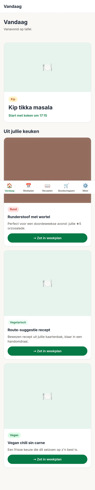
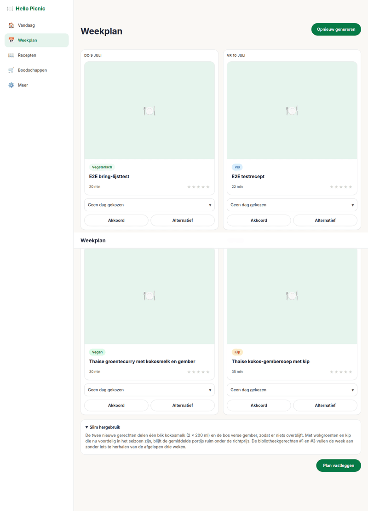
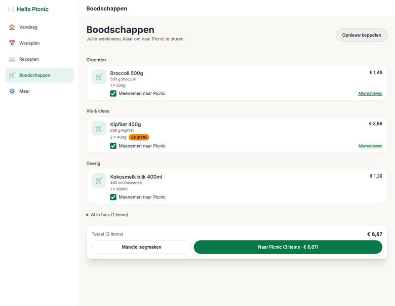
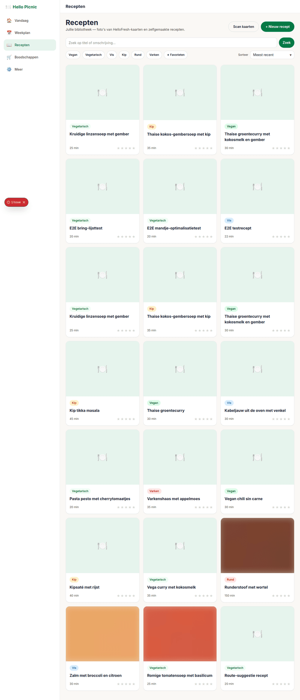
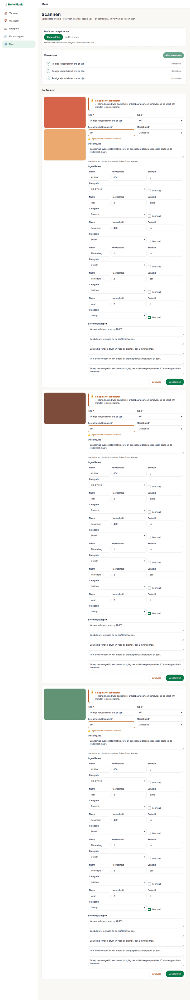
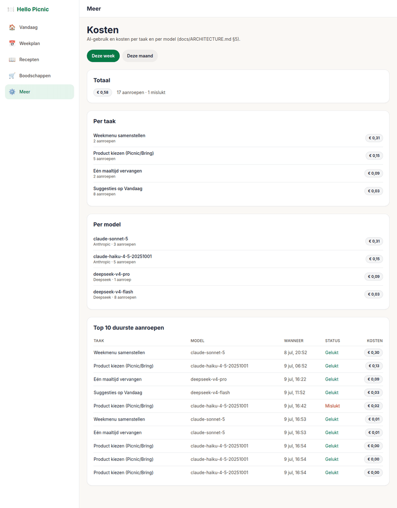

# Hello Picnic

AI-maaltijdplanner voor het gezin: weekmenu, HelloFresh-kaarten scannen, Picnic/Bring-
boodschappen en Google Agenda-koppeling, allemaal in één app. Mobile-first, photo-first,
"dicht bij HelloFresh" (`docs/DESIGN_PRINCIPLES.md`).

Dit is **v2** — een volledige herbouw op Next.js/Postgres. De oorspronkelijke v1
(losse pagina's, bestandsopslag, Electron-desktop) is met WP-14 verwijderd nadat elke
functie een plek in v2 kreeg; zie `docs/PARITY.md` voor de volledige overdracht.

## Wat kan de app

- **Vandaag** — vanavond in één oogopslag: het geplande gerecht met kooktijd, plus
  proactieve suggesties "uit jullie keuken" op basis van jullie eigen bibliotheek
  (beoordeling, favorieten, seizoen, recent gekookt).
- **Weekplan** — genereer een weekmenu met porties/dagen/wensen, wijs dagen toe,
  vervang losse maaltijden, publiceer kookmomenten naar Google Agenda.
- **Recepten** — bibliotheek met foto, sterren, favorieten, cook-mode met
  portie-schaling en wake-lock; HelloFresh-kaarten scannen (foto → recept via AI-
  extractie met per-veld betrouwbaarheid).
- **Boodschappen** — automatische productkoppeling bij Picnic (pakketmaten, promoties,
  alternatieven-switcher) of een simpele Bring!-lijst; kastinventaris, allergieën en
  "op te maken"-producten worden overal meegewogen.
- **Meer** — instellingen (AI-modellen per taak, Picnic/Bring/Google-koppelingen,
  gezinsvoorkeuren), kosten-dashboard voor AI-gebruik, app-installatie-instructies.
- **Android-app** — een dunne Capacitor-schil rond dezelfde site (`deploy/ANDROID.md`);
  op iPhone en als snelle fallback werkt de PWA ("Zet op beginscherm", instructies onder
  Meer).

## Screenshots

| Vandaag | Weekplan |
|---|---|
|  |  |

| Boodschappen | Recepten |
|---|---|
|  |  |

| Kaart scannen | Kosten |
|---|---|
|  |  |

(Bijgewerkt via Playwright e2e-runs — `e2e/__screenshots__/` zelf is gitignored, deze
zes zijn gecomprimeerd gekopieerd naar `docs/screenshots/` zodat ze op GitHub zichtbaar
zijn.)

## Snel starten (lokaal ontwikkelen)

```bash
cp .env.example .env                 # DATABASE_URL, APP_SECRET, AUTH_SECRET, LLM-keys
docker compose -f deploy/docker-compose.dev.yml up -d   # lokale Postgres
npm install
npm run db:migrate
npm run create-user                  # eerste gezinslid-account
npm run dev
```

Open `http://localhost:3000`.

## Testen

```bash
npm run lint && npm run typecheck
npm run test:ci                                   # unit (vitest)
npm run e2e                                        # Playwright, incl. axe a11y + screenshots
```

CI (`.github/workflows/ci.yml`) draait dezelfde stappen tegen een Postgres-service met
`FAKE_AI=1` (en `FAKE_PICNIC`/`FAKE_BRING`/`FAKE_GOOGLE` in de betreffende specs) — er
wordt nooit een live externe API aangeroepen in CI. Zie `docs/TESTING.md` voor de volledige
teststrategie en `docs/PARITY.md` voor wat er nog een eenmalige echte proefronde nodig
heeft.

## Uitrollen naar productie

- `deploy/README.md` — VPS-uitrol (Docker Compose, Postgres, Caddy, backups).
- `deploy/GOOGLE_OAUTH.md` — eenmalige Google Cloud-console stappen voor de
  Agenda-koppeling.
- `deploy/ANDROID.md` — Android-app bouwen en signeren (Capacitor-schil, geen bundelde
  web-assets — laadt gewoon de live VPS-URL) en sideloaden op beide telefoons.

## Eigenaar-taken bij oplevering (nog niet gedaan in dit environment)

Deze sandbox heeft geen Android SDK, geen echte Picnic/Bring/Google-accounts en geen
netwerktoegang tot een aantal build-tools — onderstaande zijn bewust uitgestelde,
eenmalige taken voor een omgeving met die toegang:

1. **Echte Picnic-ronde**: verbinden met een echt Picnic-account (incl. 2FA), een
   weekplan echt naar het mandje sturen en de promoties/pakketmaten met eigen ogen
   controleren (`docs/workpackages/WP-09-picnic-client-v2.md`, `WP-10`).
2. **Kaart-scan model-evaluatie**: `scan_card` staat voorlopig op een prijs-geverifieerd
   maar niet Nederlands-OCR-getest model (`src/server/integrations/ai/models.ts`) — een
   echte proefronde met HelloFresh-kaartfoto's moet het beste model per taak bevestigen.
3. **WP-07 fotogeneratie-smaaktest**: zie `docs/PARITY.md` punt 12 — AI-gegenereerde
   receptfoto's zijn in v2 nog niet gebouwd (alleen de infrastructuur bestaat). Architect-
   beslissing nodig: alsnog bouwen, of bewust laten vervallen.
4. **Android-signering + installatie**: keystore genereren, `assetlinks.json` invullen,
   `./gradlew assembleRelease`, sideloaden op beide telefoons, camera- en deep-link-
   gedrag op een echt toestel bevestigen (`deploy/ANDROID.md`).
5. **Google Agenda**: een echte OAuth-client aanmaken en één publiceer-rondje met een
   echt account draaien (`deploy/GOOGLE_OAUTH.md`).
6. **Lighthouse**: geen Lighthouse-CLI beschikbaar in deze sandbox om de CI-installatie
   te verifiëren — zie de opmerking in `.github/workflows/ci.yml` en overweeg de stap
   op een omgeving met volledige netwerktoegang te activeren.
